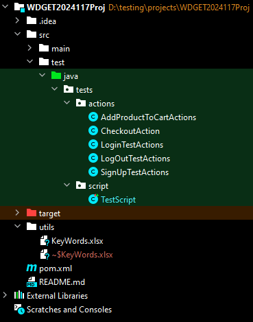

# Keyword-Driven Testing Framework

## Overview

This project implements a keyword-driven approach to testing using Selenium with Java and TestNG. The framework allows for the automation of various actions on a website using predefined keywords. This README provides detailed information on how to set up and use the framework effectively.

## Keywords and Corresponding Actions

- `registerUser`: Opens the browser with the website's URL and registers a new user.
- `logOut`: Logs out of the website.
- `logIn`: Logs in to the newly created account.
- `addToCart`: Adds a product to the cart.
- `checkout`: Proceeds to checkout with the product in the cart.
- `validation`: Validates the test using the page title.

## Project Structure

The `actions` package contains individual action classes corresponding to each keyword. These classes implement the necessary logic to perform the actions on the website. The `script` package contains TestNG test classes where test scenarios are defined using the keywords.

